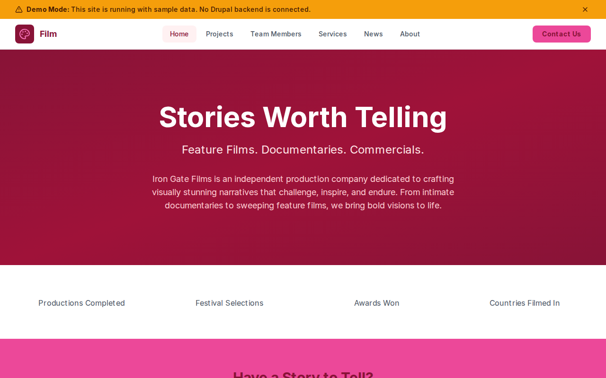

# Decoupled Film

A film production company website starter template for Decoupled Drupal + Next.js. Built for production companies, filmmakers, post-production studios, and creative agencies.



## Features

- **Project Portfolio** - Showcase feature films, documentaries, commercials, and music videos with credits and festival selections
- **Team Directory** - Present directors, cinematographers, and key creatives with bios and notable credits
- **Production Services** - Detail full production, post-production, and visual effects capabilities
- **Company News** - Publish festival selections, award wins, and company announcements
- **Modern Design** - Clean, accessible UI optimized for film and video content

## Quick Start

### 1. Clone the template

```bash
npx degit nextagencyio/decoupled-film my-film-company
cd my-film-company
npm install
```

### 2. Run interactive setup

```bash
npm run setup
```

This interactive script will:
- Authenticate with Decoupled.io (opens browser)
- Create a new Drupal space
- Wait for provisioning (~90 seconds)
- Configure your `.env.local` file
- Import sample content

### 3. Start development

```bash
npm run dev
```

Visit [http://localhost:3000](http://localhost:3000)

---

## Manual Setup

<details>
<summary>Click to expand manual setup steps</summary>

### Authenticate with Decoupled.io

```bash
npx decoupled-cli@latest auth login
```

### Create a Drupal space

```bash
npx decoupled-cli@latest spaces create "My Film Company"
```

Note the space ID returned. Wait ~90 seconds for provisioning.

### Configure environment

```bash
npx decoupled-cli@latest spaces env 1234 --write .env.local
```

### Import content

```bash
npm run setup-content
```

This imports:
- Homepage with hero, stats, featured projects, and CTA
- 3 Projects (Salt & Stone feature film, Beneath the Ice documentary, Ember Whiskey commercial)
- 3 Team Members (Director, Documentary Director, Director of Photography)
- 3 Production Services (Full Production, Post-Production, Visual Effects)
- 3 News Articles (Venice selection, IDFA award, facility expansion)
- 2 Static Pages (About, Contact)

</details>

## Content Types

### Project
- **project_type**: Classification (Feature Film, Documentary, Commercial, Music Video, etc.)
- **director**: Director name
- **release_year**: Year of release
- **runtime**: Duration
- **image**: Featured still or promotional image
- **trailer_url**: Link to trailer

### Team Member
- **position**: Role (Director, DP, Producer, etc.)
- **notable_credits**: List of notable film credits
- **photo**: Professional headshot

### Service
- **service_area**: Category (Production, Post-Production, Visual Effects, etc.)
- **icon_name**: Icon identifier for the service
- **image**: Service-related image

### News
- **news_category**: Category (Festival, Award, Announcement, Behind the Scenes, etc.)
- **publish_date**: Publication date
- **image**: Featured image

## Customization

### Colors & Branding
Edit `tailwind.config.js` to customize colors, fonts, and spacing.

### Content Structure
Modify `data/film-content.json` to add or change content types and sample content.

### Components
React components are in `app/components/`. Update them to match your design needs.

## Demo Mode

Demo mode allows you to showcase the application without connecting to a Drupal backend.

### Enable Demo Mode

```bash
NEXT_PUBLIC_DEMO_MODE=true
```

### Removing Demo Mode

1. Delete `lib/demo-mode.ts`
2. Delete `data/mock/` directory
3. Delete `app/components/DemoModeBanner.tsx`
4. Remove `DemoModeBanner` from `app/layout.tsx`
5. Remove demo mode checks from `app/api/graphql/route.ts`

## Deployment

### Vercel (Recommended)
[](https://vercel.com/new/clone?repository-url=https://github.com/nextagencyio/decoupled-film)

### Other Platforms
Works with any Node.js hosting platform that supports Next.js.

## Documentation

- [Decoupled.io Docs](https://www.decoupled.io/docs)
- [Next.js Documentation](https://nextjs.org/docs)
- [Drupal GraphQL](https://www.decoupled.io/docs/graphql)

## License

MIT
